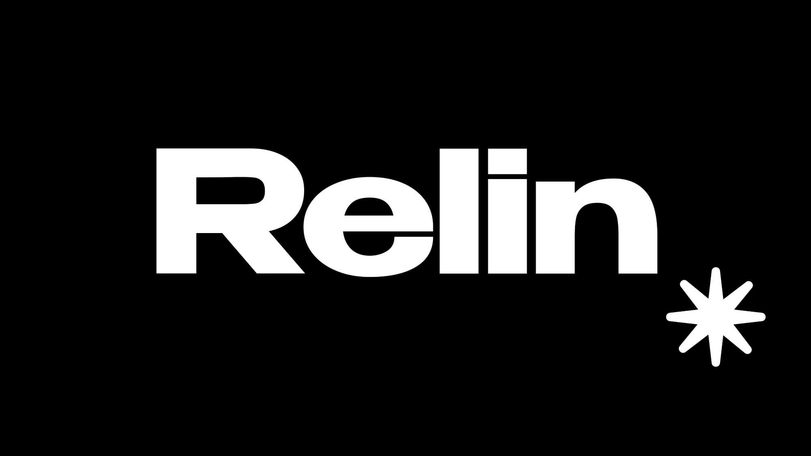
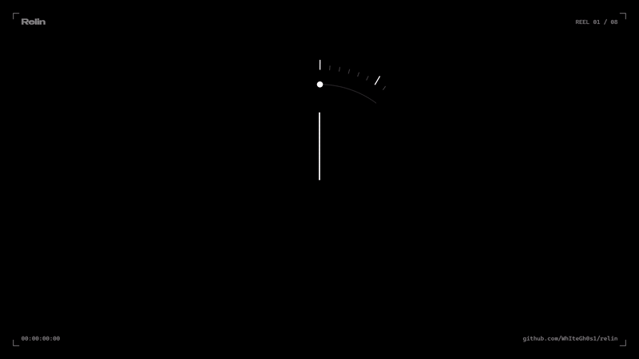
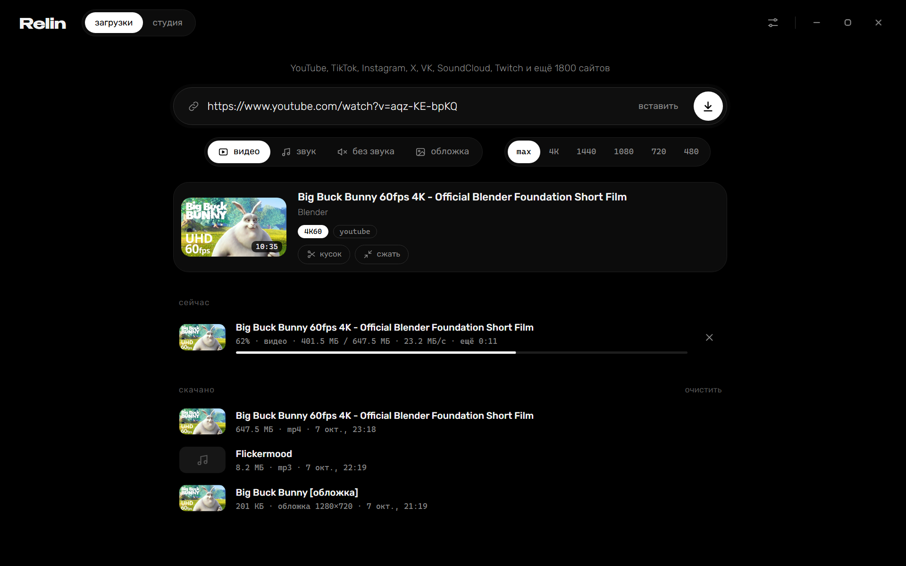
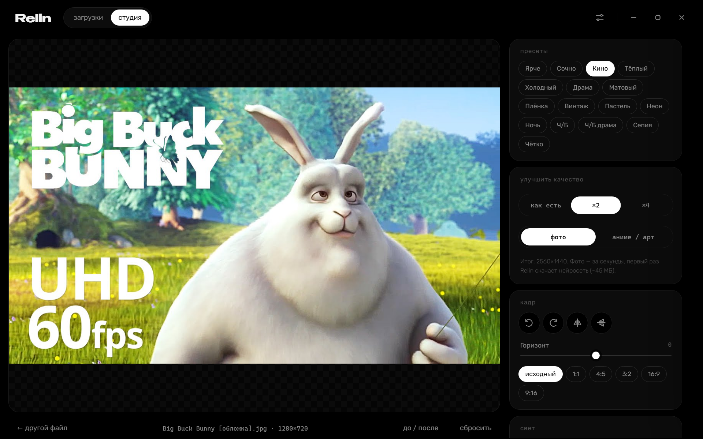

  

  <b>Скачивай видео и музыку откуда угодно — на максимальном качестве.</b> 
  YouTube, TikTok, Instagram, X, VK, Rutube, SoundCloud, Twitch и ещё 1800 сайтов. Одна программа для Windows.

  

  <a href="https://github.com/WhIteGh0s1/relin/releases">все версии</a> &nbsp;·&nbsp; <a href="#частые-вопросы">частые вопросы</a> &nbsp;·&nbsp; Windows 10 и 11

 

  

<a href="docs/reel.mp4">▶ смотреть со звуком</a>

 

  

## Как это работает

1. Копируешь ссылку на видео — где угодно, в браузере или в Telegram.
2. У часов всплывает Relin: **видео**, **звук** или **обложка** — один клик.
3. Готово. Файл лежит в «Загрузках», а Relin уже ждёт следующую ссылку.

Можно и по-старому: открыть Relin, вставить ссылку и нажать скачать. Можно вставить сразу десяток ссылок — Relin скачает все, по три за раз.

## Что умеет

### Загрузки

- **Максимальное качество.** До 4K и 8K, 60 кадров, HDR — ровно то, что отдаёт сайт. Можно выбрать 1440, 1080, 720…
- **Видео, звук, без звука или обложка.** Звук — в оригинальном качестве, mp3 320, m4a, opus, flac или wav, с обложкой и тегами.
- **Кусок вместо всего ролика.** «С 1:23 по 1:31» — и только этот фрагмент. Для эдитов, мемов и звуков.
- **GIF** из любого куска видео.
- **По главам.** Часовой микс или альбом с YouTube режется на отдельные треки с названиями.
- **Сжать под Discord и Telegram** — 10, 25 или 50 МБ. Если файл и так влезает, Relin его не трогает.
- **Стримы.** Запись прямого эфира с Twitch, YouTube и других, кнопка «стоп и сохранить». YouTube — даже с самого начала эфира.
- **Каналы.** Подпишись на канал или плейлист — Relin сам будет докачивать новые видео.
- **Плейлисты, субтитры, выравнивание громкости**, проверка «уже скачано».

### Студия

  

- **Улучшение качества нейросетью** (Real-ESRGAN): фото и видео ×2 и ×4, режимы «фото» и «аниме / арт». Меньше мыла, шума и квадратов.
- **Правка фото и видео:** экспозиция, контраст, тени, светлые, температура, оттенок, насыщенность, резкость, чёткость, шумодав, зерно, виньетка, ч/б, сепия.
- **Кадр:** поворот, отражение, выравнивание горизонта, обрезка 1:1, 4:5, 16:9, 9:16.
- **16 пресетов:** Кино, Плёнка, Винтаж, Драма, Неон, Ночь, Ч/Б…
- Предпросмотр меняется сразу; зажми картинку — увидишь оригинал. Оригинал не меняется: сохраняется новый файл.

### Живые обои

Если стоит [Drift](https://github.com/WhIteGh0s1/drift) — любое скачанное или обработанное видео одной кнопкой становится живыми обоями рабочего стола.

### Сам по себе

- Работает в трее и ловит скопированные ссылки, не мешая.
- Обновляется сам — и программа, и движок для сайтов.
- Пропал интернет или выключился компьютер — докачает с того же места.
- Тёмный, быстрый, без рекламы и регистрации.

## Установка

1. [Скачай установщик](https://github.com/WhIteGh0s1/relin/releases/latest/download/relin-setup.exe) и запусти.
2. Нажми «Установить». Права администратора не нужны.

Нужна Windows 10 или 11 (64-бит). Всё необходимое уже внутри: ffmpeg, движок для сайтов. Если на компьютере нет Node.js, установщик предложит докачать небольшой движок для YouTube — без него YouTube отдаёт не все качества.

Удалить — как любую программу: «Параметры → Приложения → Relin». Скачанные файлы останутся.

## Частые вопросы

<b>YouTube пишет «Sign in to confirm you're not a bot»</b>

YouTube так защищается от ботов и чаще всего ругается на IP от VPN. Смени сервер VPN или выключи его — обычно этого хватает. Если повторяется, в настройках Relin есть «Войти в YouTube»: с аккаунтом проверка почти не появляется (лучше взять второй, неосновной аккаунт).

<b>Видео в 4K не открывается в «Медиаплеере» Windows</b>

YouTube отдаёт 4K в кодеке AV1. Windows открывает его после установки бесплатного расширения от Microsoft — Relin сам предложит его поставить. Пока расширения нет, Relin качает в совместимом формате. VLC открывает всё и без этого.

<b>Какой-то сайт перестал качаться</b>

Сайты постоянно что-то меняют. Relin раз в сутки сам обновляет движок, а в настройках есть кнопка «обновить сейчас».

<b>Можно ли скачать музыку со Spotify, Apple Music, Deezer?</b>

Нет: музыка там зашифрована (DRM), и так не умеет ни одна подобная программа. Ту же музыку почти всегда можно найти на YouTube, YouTube Music или SoundCloud.

<b>Где лежат файлы и как поменять папку?</b>

По умолчанию — в «Загрузках». Папка меняется в настройках, там же кнопка «открыть». У каждого файла в истории есть «показать в папке».

<b>Как полностью закрыть Relin?</b>

Крестик сворачивает Relin в трей, чтобы он продолжал ловить ссылки. Закрыть совсем — правой кнопкой по значку в трее → «Выход».

## Честно

Relin — инструмент для личного использования: сохранить ролик, чтобы посмотреть без интернета, сделать нарезку, послушать трек. Уважай авторов: не выдавай чужое за своё и не перезаливай без разрешения.

## Спасибо

Relin стоит на плечах отличных открытых проектов: [yt-dlp](https://github.com/yt-dlp/yt-dlp), [FFmpeg](https://ffmpeg.org), [Real-ESRGAN](https://github.com/xinntao/Real-ESRGAN), [pywebview](https://pywebview.flowrl.com).

 

Little White Ghost

